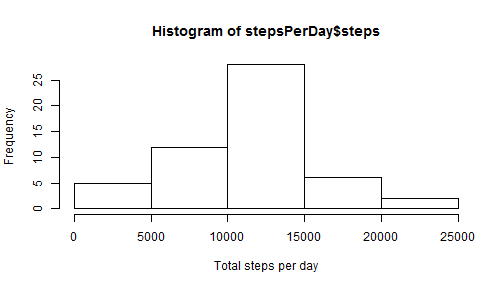
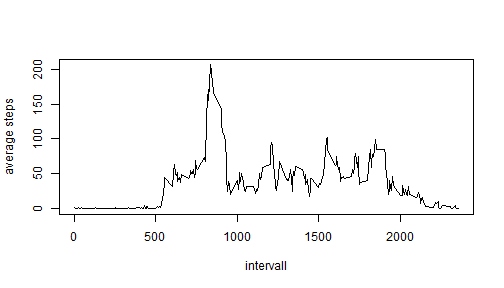
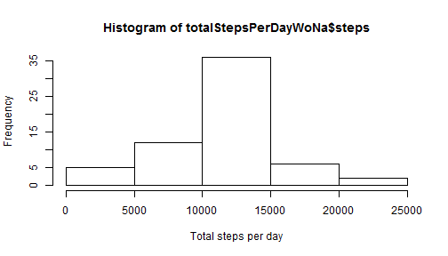
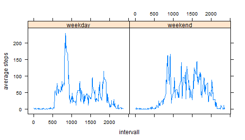

Reproducible Research - Peer Assesment 1
===========================================

###Introduction
In this exercise we perform data analysis on the number of steps taken in 5 minute intervals each day by an individual over a period of 2 months in 2012.

###Data

The variables included in this dataset are:

* steps: Number of steps taking in a 5-minute interval (missing values are coded as NA)

* date: The date on which the measurement was taken in YYYY-MM-DD format

* interval: Identifier for the 5-minute interval in which measurement was taken

The dataset is stored in a comma-separated-value (CSV) file and there are a total of 17,568 observations in this dataset.


###Load and preprocess the data

1. Set working directory to the folder where the activity.csv file is located. Read the data as csv.

```r
#setwd("./Coursera/JH Datascience Track/5 - Reproducible Research/pa1/")
data <- read.csv("activity.csv",sep=",")
```

2. Keep only complete cases, i.e. datasets without missing values


```r
dataClean <- data[complete.cases(data),]
```


###What is mean total number of steps taken per day?

1. Calculate total steps per day. 


```r
stepsPerDay <- aggregate(steps ~ date, data=dataClean, FUN=sum)
```

2. Histogram of total steps per day


```r
hist(stepsPerDay$steps,xlab="Total steps per day")
```

 

3. Calculate the mean and median of the steps per day


```r
meanStepsPerDay <- mean(stepsPerDay$steps)
medianStepsPerDay <- median(stepsPerDay$steps)
```

Results: Mean(stepsPerDay) = 1.0766189 &times; 10<sup>4</sup>; Median(stepsPerDay) = 10765


###What is the average daily activity pattern?

1. Make a time series plot of average steps vs 5 minute interval 


```r
meanStepsPerInterval <- aggregate(steps ~ interval, data=dataClean, FUN=mean)
plot(meanStepsPerInterval$steps ~ meanStepsPerInterval$interval, type="l", xlab="intervall", ylab="average steps")
```

 

2. Which 5-minute interval, on average across all the days in the dataset, contains the maximum number of steps?


```r
idxMax <- which(meanStepsPerInterval$steps == max(meanStepsPerInterval$steps),arr.ind=TRUE)
```

The 104th 5 minute intervall (at 835 min) contains on average the maximum number of steps per day.


###Impute missing values

1. Calculate and report the total number of missing values in the dataset


```r
idxNa <- which(is.na(data$steps) == TRUE, arr.ind = TRUE)
totalNas <- length(which(is.na(data$steps) == TRUE, arr.ind = TRUE))
```

In total there are 2304 missing values.

2. and 3. Fill all the missing step values in the original dataset with the average no of steps at a given intervall over all other days.


```r
dataWoNa <- data
for(i in 1:length(idxNa)){
   filterNa <- meanStepsPerInterval$interval == dataWoNa$interval[idxNa[i]]
   dataWoNa$steps[idxNa[i]] <- meanStepsPerInterval$steps[filterNa]
}
```

4. Make a histogram of the total number of steps taken each day and Calculate and report the mean and median total number of steps taken per day. Do these values differ from the estimates from the first part of the assignment? What is the impact of imputing missing data on the estimates of the total daily number of steps?


```r
totalStepsPerDayWoNa <- aggregate(steps ~ date, data=dataWoNa, FUN=sum)
meanTotalStepsPerDayWoNa <- mean(totalStepsPerDayWoNa$steps)
medianTotalStepsPerDayWoNa <- median(totalStepsPerDayWoNa$steps)
hist(totalStepsPerDayWoNa$steps,xlab="Total steps per day")
```

 

The histogram changes since we have now values included that we did not account for before. The mean of the sum of the steps per day is 1.0766189 &times; 10<sup>4</sup> and therefore equal to the one of the cleaned data. In contrast the median slightly change to 1.0766189 &times; 10<sup>4</sup>.


###Are there differences in activity patterns between weekdays and weekends?

1. Create a new factor variable in the dataset with two levels - "weekday" and "weekend" indicating whether a given date is a weekday or weekend day.


```r
dateVec <- as.Date(dataWoNa$date)
days <- weekdays(dateVec)
idxWeekend <- days == "Sonntag" | days == "Samstag" | days == "Sunday" | days == "Saturday"
wds <- character(length(dateVec))
wds[idxWeekend == FALSE] <- "weekday"
wds[idxWeekend] <- "weekend"
dataWoNa$dayCategory <- as.factor(wds)
```

2. Make a panel plot containing a time series plot of the 5-minute interval (x-axis) and the average number of steps taken, averaged across all weekday days or weekend days (y-axis).


```r
library(lattice) #lattice library needs to be installed
meanStepsPerIntervalDayCategory <- aggregate(steps ~ interval+dayCategory, data=dataWoNa, FUN=mean)
xyplot(steps~interval|dayCategory, data=meanStepsPerIntervalDayCategory, type="l", xlab="intervall", ylab="average steps")
```

 
